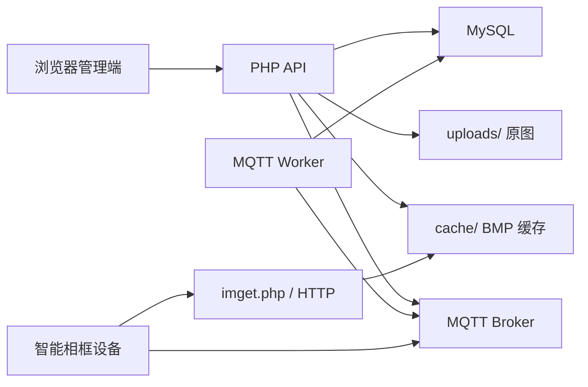

# SmartFrameCloud

[GitHub 仓库](https://github.com/aka-Laythy/SmartFrameCloud)

SmartFrameCloud 是一个面向智能相框场景的轻量级云平台，负责把用户图片资产、设备绑定流程和图片下发链路串起来。

项目当前采用单体架构，技术路线为：

- 原生 HTML / CSS / JavaScript 前端
- PHP API
- MySQL
- 本地文件存储
- MQTT Broker / Worker
- 设备端通过 HTTP 拉取 BMP 资源

它不是通用 IoT 平台，而是一个围绕“相册管理 + 设备认领 + 墨水屏图片下发”设计的垂直 AIoT Web 应用。

## 核心能力

- 用户注册、登录、验证码校验、Session 会话管理
- 相册创建、删除、封面设置、图片上传与浏览
- 设备动态绑定码认领
- 设备列表管理、解绑、当前显示图片记录
- 原图到 BMP 的服务端转换与缓存
- 图片下发预览：方向切换、旋转、兴趣区拖拽、裁剪缩放
- MQTT 控制下发 + HTTP 文件拉取的双通道分发
- 调试接口：渲染调试、下发调试

## 业务闭环

### 1. 图片资产闭环

1. 用户注册并登录平台
2. 创建相册并上传图片
3. 图片元数据入库，原图保存到 `uploads/`
4. 设备页选择图片并发起下发

### 2. 设备认领闭环

1. 设备联网后向 MQTT 上报自身注册消息
2. `subscribe_bound.php` 订阅设备注册主题并写入数据库
3. `publish_bind_codes.php` 为在线且未绑定设备下发 6 位动态绑定码
4. 用户在 Web 端输入动态绑定码完成设备认领

### 3. 图片下发闭环

1. 用户在 `devices.html` 中选择设备和图片
2. 前端提交图片 ID、设备 ID 和渲染参数
3. 后端生成 BMP 缓存并记录下发日志
4. 服务端通过 MQTT 通知设备拉取图片
5. 设备通过 HTTP 访问 `imget.php` 获取 BMP 资源并显示

## 架构说明



### 通信分层

- MQTT：用于设备注册、绑定码下发、图片控制消息
- HTTP：用于图片资源下载

这种设计避免把 BMP 二进制直接塞进 MQTT，降低消息体积和设备端处理复杂度。

## 技术栈

- 前端：原生 HTML / CSS / JavaScript
- 后端：PHP 8.1+
- 数据库：MySQL 5.7+
- 图片处理：PHP GD
- 消息通道：MQTT Broker
- 部署形态：Nginx + PHP-FPM

## 目录结构

```text
SmartFrameCloud/
├── index.html                      # 登录页
├── register.html                   # 注册页
├── dashboard.html                  # 控制台
├── albums.html                     # 相册管理
├── devices.html                    # 设备管理与图片下发
├── imget.php                       # 设备侧图片获取入口
├── css/
│   └── style.css                   # 全局样式
├── backend/
│   ├── api/
│   │   ├── auth/                   # 登录、注册、退出、验证码
│   │   ├── albums/                 # 相册接口
│   │   ├── devices/                # 设备绑定、解绑、下发、调试
│   │   ├── imgprocess/             # BMP 渲染
│   │   ├── upload/                 # 图片上传
│   │   └── user/                   # 用户资料与统计
│   ├── config/
│   │   └── database.php            # 数据库 / MQTT / 应用配置
│   ├── includes/
│   │   └── functions.php           # 公共函数与核心业务逻辑
│   └── mqtt/
│       ├── subscribe_bound.php     # 设备注册订阅器
│       └── publish_bind_codes.php  # 动态绑定码发布器
├── uploads/                        # 原图存储目录
├── cache/                          # BMP 缓存目录
└── notes/                          # 调研、部署、接口与 SQL 文档
```

## 数据模型

核心表如下：

- `users`：用户账号
- `albums`：相册
- `images`：图片元数据
- `devices`：设备实例、在线状态、动态绑定码、当前显示图片
- `device_image_logs`：图片下发日志

初始化结构见：

- `notes/sql/smartframe-struct-260418.sql`
- `notes/sql/mysql57-add-dyn_bound_code-to-devices.sql`
- `notes/sql/mysql57-add-dyn-bind-code-expire-columns.sql`

## 环境要求

- PHP `8.1+`
- MySQL `5.7+`
- Nginx
- PHP GD 扩展
- MQTT Broker
- 一个可被设备访问到的 HTTP 地址

## 快速开始

### 1. 克隆项目

```bash
git clone https://github.com/aka-Laythy/SmartFrameCloud.git
cd SmartFrameCloud
```

### 2. 创建目录

确保以下目录存在且 Web 服务具有写权限：

- `uploads/`
- `cache/`

### 3. 初始化数据库

导入：

```text
notes/sql/smartframe-struct-260418.sql
```

如果你的数据库结构较旧，再补充执行：

```text
notes/sql/mysql57-add-dyn_bound_code-to-devices.sql
notes/sql/mysql57-add-dyn-bind-code-expire-columns.sql
```

### 4. 修改配置

编辑：

```text
backend/config/database.php
```

至少需要确认以下配置：

- `DB_HOST`
- `DB_NAME`
- `DB_USER`
- `DB_PASS`
- `MQTT_HOST`
- `MQTT_PORT`
- `MQTT_USER`
- `MQTT_PASS`
- `APP_URL`
- `UPLOAD_PATH`
- `UPLOAD_URL`

### 5. 启动 Web 服务

推荐部署方式：

- Nginx
- PHP-FPM
- 项目作为站点根目录或子目录部署

如果是子目录部署，例如 `/cloud/`，需要确保：

- 静态页面可直接访问
- `uploads/` 和 `cache/` 可被正确读取
- `APP_URL` 与实际对外访问地址一致

### 6. 启动 MQTT Worker

在 CLI 中运行：

```bash
php backend/mqtt/subscribe_bound.php
php backend/mqtt/publish_bind_codes.php
```

推荐将两者交给守护进程、Supervisor 或面板定时任务管理。

## 关键配置说明

### `APP_URL`

`APP_URL` 必须是设备可访问的外部地址，因为设备最终通过该地址下载 BMP 文件。

### `UPLOAD_URL`

如果项目以子目录形式部署，例如 `/cloud/`，需要确认上传资源 URL 是否与 Nginx 路径映射一致。

### 图片处理能力

当前 BMP 渲染链路支持：

- 横屏 `800 x 480`
- 竖屏 `480 x 800`
- 旋转角度：`0 / 90 / 180 / 270`
- `crop_zoom` 范围：`0.5 ~ 4.0`
- 裁剪越界时白底补边
- BMP 缓存按渲染参数签名复用

## 设备侧约定

### 注册主题

设备注册消息主题：

```text
device/<DEVICE_UID>/bound
```

### 动态绑定码

- 长度：6 位数字
- 适用对象：在线且未绑定设备
- 过期机制：短时有效

### 图片拉取

设备接收到控制消息后，通过 HTTP 请求 `imget.php` 获取 BMP 文件。

## 调试接口

项目内置了若干联调接口：

- `backend/api/devices/debug-render.php`
- `backend/api/devices/debug-send-image.php`
- `backend/api/devices/send-image.php`
- `backend/api/imgprocess/imgprocess.php`

更详细的调用说明见：

- `notes/10-后端调试接口getpost-2026-04-19.md`

## 已知边界

- 当前前端为传统多页面应用，不是 SPA
- 当前配置文件未做 `.env` 抽离
- 当前 MQTT Worker 为独立 CLI 脚本，不是统一任务框架
- 当前项目聚焦单场景智能相框，不包含通用 IoT 平台能力

## 安全提示

当前仓库使用 `backend/config/database.php` 保存运行配置。部署前请务必检查并替换：

- 数据库账号密码
- MQTT 账号密码
- 默认站点地址

如果项目对外开放，建议进一步补齐：

- 配置与密钥的环境隔离
- 生产环境错误显示关闭
- 上传目录访问控制
- 默认账号口令移除或重置
- Worker 守护与日志轮转

## 相关文档

- `notes/1-部署教程-智能相册云平台.md`
- `notes/3-1-技术路线-智能相框AIoT应用-2026-04-19.md`
- `notes/6-subscribe_bound.php接收的MQTT数据规范-2026-04-19.md`
- `notes/7-宝塔定时任务配置说明-动态绑定码与MQTT订阅器-2026-04-19.md`
- `notes/8-动态绑定码MQTT数据规范-2026-04-19.md`

## License

当前仓库未声明许可证。如需开源分发，建议补充明确的 License 文件。
