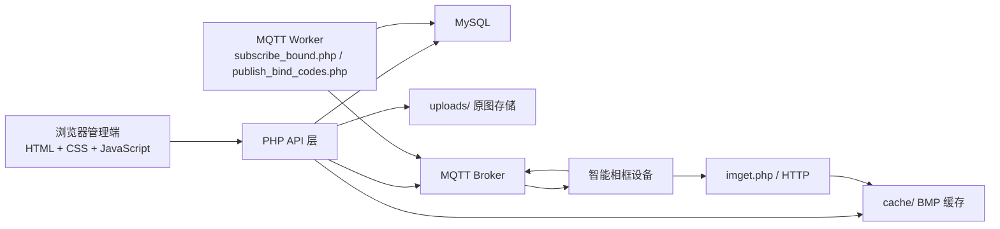

# 智能相框 AIoT 应用技术路线（深化版）

**文档日期**：2026-04-19  
**适用项目**：`SmartFrameCloud`  
**文档定位**：基于当前代码、数据库结构、前端页面、MQTT 脚本和部署资料，对项目的实际技术路线做一版更深入的整理。本文重点回答“这个云平台本质上是什么、当前已经跑通了哪些闭环、各技术组件分别承担什么职责、下一阶段应如何演进”。

## 1. 项目本质定位

`SmartFrameCloud` 当前不是一个“大而全的 IoT 平台”，而是一个围绕智能相框场景定制的、轻量级的 AIoT 云端中枢。  
它的核心目标不是做复杂设备管理，而是把下面三件事稳定串起来：

1. 用户在 Web 端管理相册和图片。
2. 设备上线后被平台识别、认领、绑定。
3. 平台把适合墨水屏显示的 BMP 图片下发给指定设备。

从当前实现看，这个项目的“AIoT”里，`IoT` 部分已经比较明确，`AI` 部分更多还停留在产品命名和未来扩展空间上。  
也就是说，当前代码真正落地的是：

- 账号体系
- 相册和图片管理
- 设备注册与绑定
- 图片渲染与分发
- MQTT/HTTP 双通道协同

而不是：

- 图像理解
- 智能推荐
- 自动编排
- 多设备群控策略

所以更准确的理解应该是：  
**这是一个以图片资产管理和设备分发为核心、以 MQTT 为设备控制信道、以 HTTP 为资源下载信道的垂直 AIoT Web 单体应用。**

## 2. 总体技术路线

项目采用的是一条非常务实的路线：  
**原生 Web 前端 + PHP API + MySQL + 本地文件存储 + MQTT Worker + 设备端 HTTP 拉取**。

这条路线的优点很明确：

- 易部署，适合宝塔/PHP 主机环境。
- 组件少，链路短，便于快速迭代。
- 业务模型集中，适合当前单产品、单场景、单团队开发。
- 图片下发场景天然适合“控制走 MQTT、内容走 HTTP”的双通道设计。

这条路线的核心不是“技术先进”，而是“足够简单、足够落地、足够贴合当前产品阶段”。

可以把当前架构理解成下面这个形态：

## 3. 当前已经形成的三条业务闭环

## 3.1 用户图片资产闭环

用户侧已经形成了一个完整但轻量的内容管理闭环：

1. 用户注册后自动创建默认相册。
2. 用户可以新建相册。
3. 用户可以向相册上传 JPG/PNG/GIF/WebP 图片。
4. 图片元数据入库，原图按日期目录存入 `uploads/YYYY/MM/`。
5. 用户可以设置相册封面。
6. 用户在设备页选择相册中的图片，触发下发。

这里的设计重点不是做 CMS，而是给设备分发提供“可控、结构化的图片源”。

从职责上看：

- `albums` 表负责组织内容。
- `images` 表负责记录图片元数据。
- `uploads/` 负责保存原始图片文件。

这说明项目对图片的理解是：  
**数据库只管理索引和关系，文件系统保存真实内容。**

## 3.2 设备注册与认领闭环

这是当前版本最关键的演进点。

早期思路更接近“手工输入设备 UID 直接绑定”，而当前代码已经转向更像消费级 IoT 产品的做法：

1. 设备联网后向 MQTT 主题 `device/<DEVICE_UID>/bound` 上报注册消息。
2. `backend/mqtt/subscribe_bound.php` 长驻订阅该主题，并把设备写入或刷新到 `devices` 表。
3. `backend/mqtt/publish_bind_codes.php` 定时扫描“在线且未绑定”的设备。
4. 平台为设备签发短时有效的 6 位动态绑定码。
5. 动态绑定码通过 MQTT 下发到设备。
6. 设备在墨水屏上显示动态绑定码。
7. 用户在 Web 端输入该 6 位码完成认领。
8. 平台把该设备与当前用户账号绑定，并清空动态码。

这条路线比“直接填 UID”更接近真实产品形态，原因有三点：

- 用户不需要接触长串设备标识。
- 绑定行为和设备在线状态建立了关联。
- 动态码一次性、短时有效，更适合公开环境和消费级使用习惯。

这也是项目技术路线最重要的变化之一：  
**设备绑定已经从静态识别，转向了在线设备认领。**

## 3.3 图片下发与显示闭环

图片分发已经形成一条非常清晰的双通道闭环：

1. 用户在设备页选择一张原图。
2. 前端提交设备 ID、图片 ID 和渲染参数。
3. 服务端根据原图生成 BMP 缓存。
4. 服务端通过 MQTT 下发一条“图片控制消息”给设备。
5. MQTT 消息中只携带图片 URL、尺寸和方向信息。
6. 设备再通过 HTTP 请求 `imget.php` 拉取 BMP 文件。
7. 设备本地完成显示。

这个设计非常合理，因为它把“控制”和“内容”拆开了：

- MQTT：适合小消息、控制指令、状态同步。
- HTTP：适合真实文件下载和重试。

如果强行把 BMP 二进制直接塞进 MQTT，会让消息体过大、重试复杂、设备端实现更重。  
当前方案避免了这个问题。

## 4. 模块职责划分

## 4.1 Web 前端

前端是纯原生页面，不依赖框架。当前主要页面有：

- `index.html`：登录页
- `register.html`：注册页
- `dashboard.html`：控制台和统计总览
- `albums.html`：相册与图片管理
- `devices.html`：设备绑定、设备列表、图片下发

前端特点：

- 使用 `fetch` 直接请求 PHP API。
- 使用 Session 维持登录态，不走 Token/JWT。
- 页面间通过传统导航切换，不做 SPA。

这说明前端路线的选择是：

- 优先简单、稳定、低维护成本
- 不引入额外构建链
- 更适合当前 PHP 主站形态

## 4.2 PHP API 层

API 层负责全部业务规则，是项目真正的中心。

按能力可以分为四组：

1. 认证与会话
- 登录、注册、退出、验证码、用户信息

2. 内容管理
- 相册创建、删除、列表、封面设置
- 图片上传、列表

3. 设备管理
- 设备列表
- 动态码绑定
- 解绑
- 图片下发

4. 调试与运维辅助
- `debug-render.php`
- `debug-send-image.php`

这一层没有刻意做服务分层或复杂架构，而是把通用能力集中在 `backend/includes/functions.php`。  
这是一种典型的“小型单体业务代码组织方式”。

## 4.3 MySQL 数据层

数据库目前围绕五张核心表组织：

- `users`：用户账号
- `albums`：相册
- `images`：图片元数据
- `devices`：设备实例
- `device_image_logs`：图片下发日志

其中 `devices` 是最关键的一张表，它同时承载：

- 设备身份：`device_uid`
- 设备归属：`user_id`
- 设备状态：`status`、`last_online_at`
- 设备认领：`dyn_bound_code`、签发时间、过期时间
- 设备当前内容：`current_image_id`

这说明项目把“设备”理解成一个长期存在、可在线、可认领、可显示内容的实体，而不是一次性消息目标。

## 4.4 MQTT Worker 层

当前有两个独立脚本承担“后台工作进程”职责：

### `subscribe_bound.php`

职责：

- 长期订阅 `device/+/bound`
- 接收设备上行注册/心跳类消息
- 将设备写入或刷新到数据库

性质：

- 长驻型 worker
- 通过宝塔保活脚本维持运行

### `publish_bind_codes.php`

职责：

- 定期扫描在线未绑定设备
- 分配动态绑定码
- 下发动态绑定码

性质：

- 短任务型 worker
- 适合 cron 每分钟执行一次

这意味着当前系统已经不是“纯 Web 请求驱动”的系统，而是一个：

- 前台：用户请求驱动
- 后台：定时任务 + 订阅器驱动

共同组成的小型事件型系统。

## 5. 数据与通信路线

## 5.1 浏览器到云平台

浏览器通过 `fetch + FormData` 调用 PHP API，认证依赖 Session。  
这条链路的特点是：

- 适合传统站点
- 不需要前后端分离基础设施
- 接口调试成本低

代价是：

- API 规范性一般
- 与页面耦合较强
- 后续若做移动端 App 或开放 API，需要再整理一层接口契约

## 5.2 云平台到数据库

数据库访问统一通过 PDO，查询写法直白，主要依赖：

- 预处理语句
- 主外键关系
- 必要索引

这表明项目当前更偏重“实现清楚的业务闭环”，还没有进入复杂查询优化或领域建模阶段。

## 5.3 云平台到设备

云平台到设备的主动消息全部走 MQTT。

当前主要下发两类消息：

1. 动态绑定码下发  
主题：`device/<DEVICE_UID>/bound`

2. 图片下发  
主题：`device/<DEVICE_UID>/image`

这两类消息都很轻：

- 绑定码消息：短 JSON 控制载荷
- 图片消息：只发 URL 与参数，不发二进制文件

这是一种典型的轻控制面设计。

## 5.4 设备到云平台

设备端当前最关键的上行主题也是：

`device/<DEVICE_UID>/bound`

但这里要注意：  
同一个主题既承接设备上行注册消息，也承接平台下行动态绑定码消息。  
当前代码通过 `event` 字段做区分：

- `reg_new_device`：设备上行
- `dyn_bound_code`：平台下行

这条路线在当前规模下可行，但从长期看有一个明显边界：  
**同主题双向复用会增加协议理解成本。**

如果后续设备类型变多，建议逐步拆分为：

- `device/<uid>/up/...`
- `device/<uid>/down/...`

或至少拆成不同业务主题。

## 5.5 设备到内容资源

设备真正获取图片不是走 MQTT，而是走：

- `imget.php?file=...`

它承担的职责是：

- 对 BMP 资源做安全访问控制
- 屏蔽真实文件路径
- 向设备输出 `image/bmp`

这说明项目在资源分发层面已经形成一个“面向设备的只读下载口”。

## 6. 图片工程路线

这部分是项目里最有“设备适配味道”的一块。

## 6.1 原图与目标图分离

当前实现没有直接修改用户上传的图片，而是采取：

- 原图放在 `uploads/`
- 设备适配图放在 `cache/`

这非常重要，因为它天然支持：

- 多次重新生成
- 不同尺寸和方向输出
- 不破坏原始资产

## 6.2 BMP 生成策略

`backend/api/imgprocess/imgprocess.php` 当前完成了：

- 图片读取
- 按目标比例裁剪
- 软旋转
- 软裁剪缩放
- 横屏/竖屏输出
- 7 色有序抖动
- 24 位 BMP V3 写出

可以看出，项目已经不再只是“把图片转成 BMP”，而是在向“面向墨水屏的渲染管线”演进。

## 6.3 渲染参数前移到前端

`devices.html` 现在已经把用户可感知的渲染控制放在前端：

- 横屏/竖屏
- 旋转
- 缩放
- 拖动兴趣区

这意味着平台的图片分发正在从“后台固定算法输出”变成“用户参与控制输出效果”的路线。  
这对智能相框是对的，因为设备显示体验直接受裁剪结果影响。

## 6.4 缓存策略

当前 BMP 文件名会附加基于渲染参数的签名。  
这说明缓存策略已经从“同一原图一个 BMP”升级为“同一原图可对应多个渲染结果”。

这是后续继续扩展的重要基础，例如：

- 多屏规格
- 多色深
- 多套渲染风格

## 7. 当前实现体现出的产品路线判断

从代码反推产品路线，可以看出团队当前在做的是一条很明确的消费级智能相框路径：

1. 先解决“设备如何被普通用户轻松绑定”。
2. 再解决“图片如何稳定适配墨水屏”。
3. 然后解决“云端如何把控制与资源正确分发给设备”。

这三步里，当前版本最明显的产品判断有两个：

### 第一，绑定优先级很高

动态绑定码、MQTT 订阅器、定时发布器、绑定说明文档都说明：  
团队已经意识到“设备认领体验”比“后台设备表结构”更重要。

### 第二，图片适配不是附属功能，而是核心体验

图片预览、方向切换、软旋转、兴趣区拖动这些都不是“后台补丁”，而是产品核心流程的一部分。  
因为智能相框用户最终感知到的不是 API 是否漂亮，而是“屏幕上显示得好不好”。

## 8. 当前技术边界与项目现状判断

为了更准确理解项目，必须同时看到“已经成型的部分”和“还没有真正完成的部分”。

## 8.1 已经成型的部分

- Web 账号体系
- 相册与图片管理主流程
- 原图存储与 BMP 派生缓存
- 设备注册入库
- 动态绑定码认领
- MQTT 控制 + HTTP 拉图的双通道设计
- 基本部署与宝塔任务说明

## 8.2 还比较初级或待完善的部分

- 前端仍是多页原生页面，复杂度继续上升后可维护性会下降。
- API 还没有统一的版本化、错误码体系和更细的服务拆分。
- MQTT 发布/订阅能力是手写轻量实现，适合当前规模，但长期可观察性一般。
- 单张图片删除前端仍有占位式实现，说明内容管理能力还没完全收口。
- 当前没有明显的设备离线补偿、回执确认、重试追踪闭环。
- 项目名中的“AI”尚未在代码层形成真正的模型能力或智能处理链路。

## 8.3 对“AIoT”三个字的实际理解

如果把这个项目放在“AIoT 产品生命周期”的视角里看，当前阶段更准确的描述是：

**它已经是一个可以支撑真实设备接入和图片分发的 IoT 云平台雏形，但还不是一个完整意义上的 AI 平台。**

这不是问题，反而是合理路线。  
先把设备接入、绑定、分发、显示做扎实，后面的智能推荐、自动排版、内容编排、用户偏好学习才有稳定落点。

## 9. 下一阶段的合理演进方向

结合当前代码结构，后续最自然的演进路径应该是：

### 9.1 先把 IoT 基础层做稳

- 完善设备上下行主题规范
- 增加设备回执与任务状态追踪
- 做更明确的在线/离线判定与超时机制
- 给后台 worker 增加更稳定的日志、监控和告警

### 9.2 再把内容分发层做强

- 支持更多设备分辨率和屏幕方向
- 支持批量下发、轮播策略、定时更换
- 引入更清晰的渲染模板或输出策略

### 9.3 最后再引入真正的 AI 能力

- 自动选图
- 智能裁剪
- 场景化轮播
- 用户偏好学习
- 图片内容理解与相册自动组织

换句话说，当前正确路线不是“立刻往项目里塞 AI”，而是：

**先把内容和设备的基础设施打牢，再让 AI 站在稳定基础设施之上工作。**

## 10. 总结

`SmartFrameCloud` 当前的技术路线，本质上是一条非常清晰的垂直场景路线：

- 用原生 Web 管理用户和图片资产
- 用 PHP 单体承载业务规则
- 用 MySQL 管理核心实体关系
- 用本地文件系统保存原图和派生图
- 用 MQTT 负责设备控制与注册信号
- 用 HTTP 负责设备下载实际显示资源
- 用动态绑定码完成设备认领
- 用前端预览和后端渲染管线保障墨水屏显示效果

如果用一句话概括当前项目：

**它已经不是“网页相册网站”，而是一套围绕智能相框场景构建的、面向设备认领和图片分发的轻量级 AIoT 云平台基础版。**

而从工程视角看，这条路线最大的优点正是：  
不追求过度设计，先用最少的技术组件，把最关键的设备闭环跑通。
